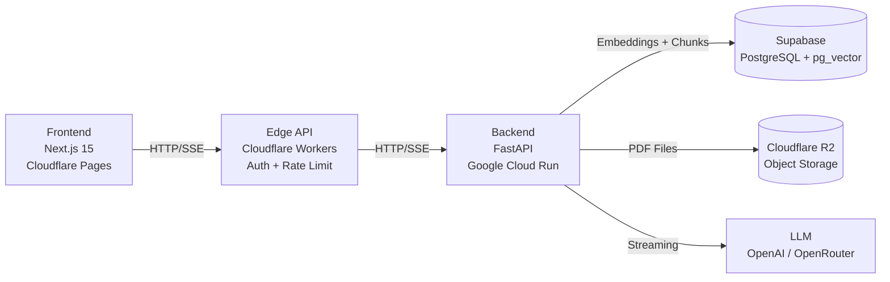

# Lemma — AI-Powered Academic Paper Analysis

[](LICENSE)
[](https://nextjs.org)
[](https://fastapi.tiangolo.com)
[](https://workers.cloudflare.com)

> Upload academic PDFs and chat with them using AI-powered retrieval-augmented generation (RAG).

Lemma helps researchers, students, and professionals quickly understand complex academic papers through a streaming chat interface — no more reading every page to find what you need.

<!-- Add a screenshot or GIF here before publishing -->
<!--  -->

## Features

- **PDF Upload** — Secure upload directly to Cloudflare R2 via pre-signed URLs
- **Smart Processing** — Semantic chunking by section, not arbitrary text splits
- **Vector Search** — Embeddings stored in Supabase pg_vector for accurate retrieval
- **Streaming Q&A** — Token-by-token streaming through the full edge → backend → LLM pipeline
- **Markdown Responses** — AI answers rendered with syntax highlighting
- **Authentication** — Supabase Auth with email, Google, and GitHub sign-in

## Architecture



## Tech Stack

| Layer | Technology |
|-------|-----------|
| Frontend | Next.js 15, React 19, Tailwind CSS 4, TypeScript |
| Edge | Cloudflare Workers, itty-router, Cloudflare KV |
| Backend | FastAPI, Python 3.12, LiteLLM, sentence-transformers, PyMuPDF |
| Database | Supabase PostgreSQL + pg_vector |
| Storage | Cloudflare R2 |
| Auth | Supabase Auth (JWT / ES256) |

## Quick Start

### Prerequisites

- Node.js 20+, pnpm 9+
- Python 3.12+
- [Supabase](https://supabase.com) account and project
- [Cloudflare](https://cloudflare.com) account with Workers and R2 enabled

### 1. Clone and install

```bash
git clone https://github.com/archlab-space/lemma.git
cd lemma
pnpm install
```

### 2. Configure environment

```bash
cp .env.example .env
# Fill in your credentials — see comments in .env.example
```

You'll need values for:
- `SUPABASE_URL` and `SUPABASE_ANON_KEY` — from Supabase Dashboard > Settings > API
- `DATABASE_URL` — from Supabase Dashboard > Settings > Database
- `R2_ACCESS_KEY_ID` / `R2_SECRET_ACCESS_KEY` — from Cloudflare R2 > Manage R2 API tokens
- `OPENAI_API_KEY` (or another LLM provider key)

### 3. Set up the database

```bash
# Run migrations in Supabase SQL editor or via psql
# See database/README.md for full instructions
```

### 4. Configure the edge worker

```bash
cd edge
cp wrangler.jsonc wrangler.local.jsonc  # or edit wrangler.jsonc with your values
# Replace YOUR_PROJECT_ID with your Supabase project ID
# Replace your-cloudflare-account-id with your Cloudflare account ID
```

### 5. Start the services

```bash
# Terminal 1 — Backend
cd backend
pip install -e ".[dev]"
uvicorn main:app --reload

# Terminal 2 — Edge Worker
cd edge
pnpm dev

# Terminal 3 — Frontend
cd frontend
pnpm dev
```

Open [http://localhost:3000](http://localhost:3000).

## Project Structure

```
lemma/
├── frontend/      # Next.js 15 app (Cloudflare Pages)
├── backend/       # FastAPI service (Google Cloud Run)
├── edge/          # Cloudflare Workers API gateway
├── database/      # SQL migrations and schema
└── docs/          # Setup and deployment guides
```

See each package's README for detailed documentation:
- [frontend/README.md](frontend/README.md)
- [backend/README.md](backend/README.md)
- [edge/README.md](edge/README.md)
- [database/README.md](database/README.md)

## Deployment

| Service | Platform |
|---------|---------|
| Frontend | Cloudflare Pages |
| Edge API | Cloudflare Workers |
| Backend | Google Cloud Run |
| Database | Supabase |
| Storage | Cloudflare R2 |

See [docs/SETUP.md](docs/SETUP.md) for full infrastructure setup instructions.

## Roadmap

### Completed (MVP)
- [x] Secure PDF upload to Cloudflare R2
- [x] PDF parsing and semantic chunking
- [x] Vector embeddings via sentence-transformers
- [x] Streaming RAG Q&A pipeline
- [x] Markdown-rendered responses
- [x] User authentication (email, OAuth)
- [x] Document management per user

### Planned
- [ ] Multi-paper chat and comparison
- [ ] Figure and table interpretation (multimodal)
- [ ] Personal knowledge library
- [ ] Citation graph analysis
- [ ] Cross-paper recommendation system
- [ ] Browser extension for one-click capture

Contributions welcome — see [CONTRIBUTING.md](CONTRIBUTING.md) to get started.

## Contributing

See [CONTRIBUTING.md](CONTRIBUTING.md) for development setup, code conventions, and PR guidelines.

## License

MIT © 2025 devasher
