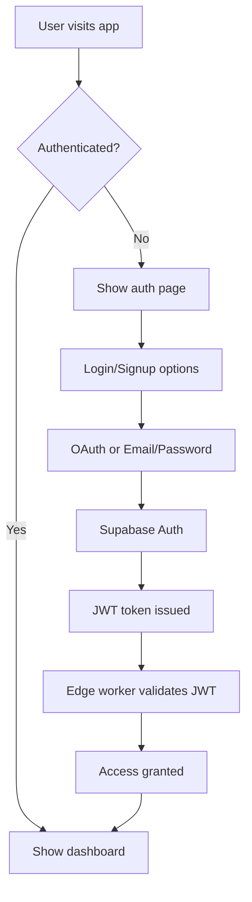

# Supabase Authentication Setup Guide

This guide walks through configuring Supabase Auth for the Lemma application.

## 🔧 **Supabase Auth Configuration**

### **1. Basic Auth Settings**

In your Supabase Dashboard → Authentication → Settings:

```bash
# Site URL (for redirects)
Site URL: http://localhost:3000

# Additional redirect URLs
Additional redirect URLs:
- http://localhost:3000/auth/callback
- https://your-production-domain.com
- https://your-production-domain.com/auth/callback
```

### **2. Email Auth Configuration**

```bash
# Email Settings
Enable email confirmations: ✅ Enabled
Enable email change confirmations: ✅ Enabled
Secure email change: ✅ Enabled

# Email Templates (customize as needed)
- Confirm signup
- Magic link
- Change email address
- Reset password
```

### **3. JWT Settings**

Your JWT configuration is already set up with ES256:

```bash
JWT expiry limit: 3600 (1 hour) - recommended for security
Refresh token rotation: ✅ Enabled
```

### **4. Security Settings**

```bash
# Rate Limiting
Rate limit email sending: ✅ Enabled

# Session Management
PKCE flow: ✅ Enabled (recommended)
Manual linking of identities: ✅ Enabled

# Advanced Security
Require email verification: ✅ Enabled
Enable phone confirmations: ❌ Disabled (for now)
```

## 🔑 **OAuth Provider Setup**

### **Google OAuth**

1. **Google Cloud Console Setup:**
   ```bash
   # Go to: https://console.cloud.google.com/
   # Create project or select existing
   # Enable Google+ API
   # Create OAuth 2.0 credentials
   ```

2. **Google OAuth Configuration:**
   ```bash
   # Authorized JavaScript origins:
   http://localhost:3000
   https://your-production-domain.com
   
   # Authorized redirect URIs:
   https://your-project.supabase.co/auth/v1/callback
   ```

3. **Supabase Configuration:**
   ```bash
   # In Supabase Dashboard → Authentication → Providers → Google
   Google enabled: ✅ Yes
   Client ID: your-google-client-id
   Client Secret: your-google-client-secret
   ```

### **GitHub OAuth**

1. **GitHub App Setup:**
   ```bash
   # Go to: https://github.com/settings/developers
   # New OAuth App
   ```

2. **GitHub OAuth Configuration:**
   ```bash
   Application name: Lemma
   Homepage URL: https://your-production-domain.com
   Authorization callback URL: https://your-project.supabase.co/auth/v1/callback
   ```

3. **Supabase Configuration:**
   ```bash
   # In Supabase Dashboard → Authentication → Providers → GitHub
   GitHub enabled: ✅ Yes
   Client ID: your-github-client-id
   Client Secret: your-github-client-secret
   ```

## 🔐 **Row Level Security (RLS) Policies**

Enable RLS on user-related tables:

### **Users Table Policies**

```sql
-- Enable RLS
ALTER TABLE users ENABLE ROW LEVEL SECURITY;

-- Users can view their own profile
CREATE POLICY "Users can view own profile" ON users
    FOR SELECT USING (auth.uid() = id);

-- Users can update their own profile
CREATE POLICY "Users can update own profile" ON users
    FOR UPDATE USING (auth.uid() = id);

-- Users can insert their own profile (signup)
CREATE POLICY "Users can insert own profile" ON users
    FOR INSERT WITH CHECK (auth.uid() = id);
```

### **Documents Table Policies**

```sql
-- Enable RLS
ALTER TABLE documents ENABLE ROW LEVEL SECURITY;

-- Users can view their own documents
CREATE POLICY "Users can view own documents" ON documents
    FOR SELECT USING (auth.uid() = user_id);

-- Users can insert their own documents
CREATE POLICY "Users can insert own documents" ON documents
    FOR INSERT WITH CHECK (auth.uid() = user_id);

-- Users can update their own documents
CREATE POLICY "Users can update own documents" ON documents
    FOR UPDATE USING (auth.uid() = user_id);

-- Users can delete their own documents
CREATE POLICY "Users can delete own documents" ON documents
    FOR DELETE USING (auth.uid() = user_id);
```

## 🎯 **Environment Variables**

Update your `.env` file:

```bash
# Supabase Auth (already configured)
SUPABASE_URL=https://your-project.supabase.co
SUPABASE_ANON_KEY=your-anon-key
SUPABASE_SERVICE_KEY=your-service-key

# OAuth Providers (add these)
GOOGLE_CLIENT_ID=your-google-client-id
GOOGLE_CLIENT_SECRET=your-google-client-secret
GITHUB_CLIENT_ID=your-github-client-id
GITHUB_CLIENT_SECRET=your-github-client-secret

# Auth URLs
NEXTAUTH_URL=http://localhost:3000
NEXTAUTH_SECRET=your-nextauth-secret
```

## 🔄 **Auth Flow Overview**



## ✅ **Verification Checklist**

- [ ] Site URL configured correctly
- [ ] Email auth enabled and tested
- [ ] JWT settings configured with ES256
- [ ] Google OAuth provider set up
- [ ] GitHub OAuth provider set up
- [ ] RLS policies created and tested
- [ ] Environment variables updated
- [ ] Auth flow tested end-to-end

## 🚀 **Next Steps**

After configuring Supabase Auth:

1. Set up OAuth providers (Google, GitHub)
2. Create auth components in frontend
3. Implement login/signup flows
4. Add password reset functionality
5. Create protected route middleware

This completes the Supabase Auth configuration for the Lemma application! 🎉